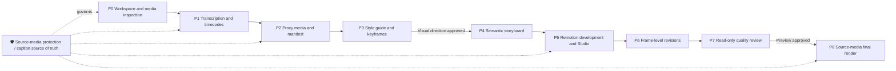

<p align="center">
  
  
  
  
</p>

<h1 align="center">🎬 remotion-talking-head-director</h1>

<p align="center">
  <b>Turn Remotion talking-head production from a one-shot bet into a controlled, previewable, frame-editable, and reviewable workflow Skill.</b><br>
  Media inspection → faithful transcription → proxy development → style frames → semantic storyboard → Studio preview → frame-level revisions → quality review → approved export
</p>

<p align="center">
  <a href="README.md">中文</a> · English
</p>

<p align="center">
  <a href="#-what-this-skill-does">Capabilities</a> ·
  <a href="#-workflow">Workflow</a> ·
  <a href="#-project-structure">Structure</a> ·
  <a href="#-installation-and-compatibility">Installation</a> ·
  <a href="#-quick-start">Quick start</a> ·
  <a href="#️-operating-boundaries-and-safety-principles">Safety</a> ·
  <a href="CONTRIBUTING.md">Contributing</a>
</p>

---

## ✨ What this Skill does

- 🎙️ **Built for spoken-video production:** supports talking heads, voice-overs, tutorials, educational videos, and mixed speaker + screen-recording/B-roll projects.
- 🧭 **P0-P8 phase gates:** every stage, from media inspection through final render, has defined inputs, artifacts, validation, and stop conditions.
- 📝 **Protects the caption source of truth:** captions come only from a verified transcription or user-supplied script. Names, numbers, and product terms are never silently rewritten.
- ⚡ **Proxy-first development:** use 720p/480p proxies for day-to-day Studio preview; use the original high-resolution source only for final export.
- 🎨 **Approve the visual direction before building the full video:** create hook, mid-video, and CTA style frames first; build the complete timeline only after approval.
- 🎞️ **Semantic storyboarding:** map each spoken information block to purposeful numbers, cards, charts, screenshots, and speaker layouts instead of adding effects for their own sake.
- 🔎 **Actionable frame-level revisions:** turn vague feedback into a change request with timecode, frame range, layers, animation, and constraints.
- ✅ **Read-only quality review:** inspect caption sync, black frames, speaker occlusion, readability, animation rhythm, and final-export risk before making changes.

## 🔄 Workflow



> [!IMPORTANT]
> This Skill does not make a full video in one pass by default. When a user simply asks to make a video, it advances only through P0-P2. P5 requires explicit approval of the visual direction; P8 requires explicit authorization for final export.

## 📂 Project structure

```text
remotion-talking-head-director/
├── SKILL.md                         # Core: triggers, P0-P8 gates, and safety constraints
├── README.md                        # Chinese documentation
├── README.en.md                     # English documentation (this file)
├── references/                      # Workflow and review references loaded when needed
│   ├── workflow.md                  # Workflow, conventions, proxies, and review guidance
│   ├── prompt-patterns.md           # Copyable task prompts
│   └── review-checklist.md          # Caption, layer, animation, media, and export checks
└── templates/                       # Production-record templates
    ├── production-state.md          # Phase, validation, approvals, and blockers
    ├── media-manifest.json          # Source, proxy, and reference-media inventory
    ├── storyboard.json              # Semantic storyboard data model
    └── review-report.md             # Timecoded review findings by severity
```

For each video, the Skill stores production records in the target Remotion project:

```text
production/
├── production-state.md
├── media-manifest.json
├── transcript/                      # transcript.txt, captions.srt, transcript.json
├── design/                          # style-guide.md and keyframes
├── storyboard/                      # storyboard.json and storyboard.md
└── reviews/                         # review-report.md
```

## 🌐 Installation and compatibility

This Skill consists of **Markdown instructions, reference material, and templates**. It can be installed in any AI tool that supports custom Skills, Rules, or project instructions. Actual video development still requires a runnable Remotion project.

| AI tool | Recommended installation | How to use it |
| --- | --- | --- |
| **Codex** | Put it in a user or project Skills directory | Describe the talking-head production task directly |
| **Claude Code** | Put it in `~/.claude/skills/` | Auto-detected or manually referenced |
| **Cursor** | Import it as a Rule or project instruction | Reference it in chat |
| **Cline / Roo Code** | Add it to Custom Instructions or rules | Invoke it in chat |
| **Any other AI tool** | Paste `SKILL.md` and retain required references/templates | Run the workflow manually |

### Install into a Skills directory

```bash
# Example: Claude Code
mkdir -p ~/.claude/skills
cp -R remotion-talking-head-director ~/.claude/skills/remotion-talking-head-director
```

> [!TIP]
> When context is limited, keep at least `SKILL.md` and `references/workflow.md`. Load the relevant checklist and templates before reviews or final export.

## 🚀 Quick start

Send one of these prompts from an existing Remotion project.

**Example 1 - First pass (through P2 only)**

> Use remotion-talking-head-director for the talking-head footage in this project. Run only P0-P2: inspect the media, create a faithful transcription with timecodes, and create a 720p proxy and media manifest. Do not design the full video or render a final video.

**Example 2 - Build after visual approval**

> The visual direction is approved. Continue with P4-P5. Create a semantic storyboard from the verified transcript and implement the Remotion timeline using proxy media. Start Studio and provide the Composition ID and preview instructions. Do not export a final video.

**Example 3 - Make a precise frame-level change**

> Target range: frames 118 through 138. Target element: the speaker video. Scale it from fullscreen to a 360px-wide card in the lower-right corner. Keep the speaker above the background and overlays; text must not cover the face. Do not modify other scenes; update Studio preview only.

**Example 4 - Final export**

> Approved for export. Run P8: save the approved version, switch to the original high-resolution media, perform representative frame checks, and render the final video to `out/final-4k.mp4`. Do not overwrite the source video.

## ⚠️ Operating boundaries and safety principles

> [!WARNING]
> - Never move, delete, or overwrite source videos, audio, captions, or reference media.
> - Never render a final MP4 without explicit authorization.
> - Never alter the actual spoken content, numbers, proper names, or product names merely to improve visuals.
> - Stop and report if source and proxy durations, rotation, or audio tracks cannot be reconciled; do not assume the timeline is valid.
> - Commercial fonts, third-party media, and components require clear authorization. Do not copy watermarks, logos, or copyrighted assets from reference videos.

## 🔌 Recommended companion Skills

This Skill owns the production process, gates, and acceptance criteria. For current Remotion APIs and implementation practices, use it alongside:

- `remotion-best-practices`
- `remotion-captions`
- `remotion-render`

If implementation specifics conflict with this Skill, follow the current official Remotion guidance. The proxy-first workflow, caption-source protection, visual approval, and final-export authorization remain mandatory.

## 🤝 Contributing

Contributions to workflow rules, Remotion practices, templates, and translations are welcome. Read the [contribution guide](CONTRIBUTING.md) before opening a change, and do not add unlicensed media, fonts, or third-party assets.

## 📄 License

This project is released under the [MIT License](LICENSE).

---

<p align="center">Made for creators who want a controllable Remotion production process.</p>
