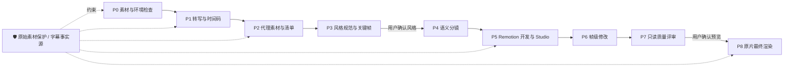

<p align="center">
  
  
  
  
</p>

<h1 align="center">🎬 remotion-talking-head-director</h1>

<p align="center">
  <b>把 Remotion 口播视频制作，从一次性“赌成片”，变成可预览、可逐帧修改、可验收的受控工作流 Skill</b><br>
  素材检测 → 真实转写 → 代理开发 → 风格关键帧 → 语义分镜 → Studio 预览 → 帧级修改 → 质量评审 → 确认后导出
</p>

<h1 align="center"><b>想要加入自媒体 AI 破局社群可联系微信：JZX_AI1203</b></h1>
<h1 align="center"><b>跨境电商AI自动化交流可联系微信：ziyi_ozon</b></h1>

<p align="center">
  中文 · <a href="README.en.md">English</a>
</p>

<p align="center">
  <a href="#-这个-skill-能给你什么">能力</a> ·
  <a href="#-工作流">工作流</a> ·
  <a href="#-目录结构">目录结构</a> ·
  <a href="#-安装与兼容性">安装</a> ·
  <a href="#-快速上手">快速上手</a> ·
  <a href="#️-使用边界与安全原则">使用边界</a>
</p>

---

## ✨ 这个 Skill 能给你什么

- 🎙️ **面向口播生产**：适用于真人出镜、纯配音、教程、知识讲解和“人物 + 屏录/B-roll”的混合视频。
- 🧭 **P0–P8 阶段门**：从素材检查到最终渲染，每一步都有明确输入、产物、验证和停止条件。
- 📝 **字幕事实源保护**：字幕只来自真实转写或用户提供的稿件；专有名词、数字和产品名不会被静默改写。
- ⚡ **代理优先开发**：日常 Studio 预览使用 720p/480p 代理，原始高分辨率素材只在最终导出时使用。
- 🎨 **先确认风格再做全片**：先完成开场、中段、CTA 三个关键帧，视觉方向获确认后才铺完整时间轴。
- 🎞️ **语义驱动分镜**：按口播信息段落匹配数字、卡片、图表、截图与人物布局，避免为了炫技而堆效果。
- 🔎 **可执行的帧级修改**：把“这里不自然”转换为时间码、帧数、图层与缓动明确的变更单。
- ✅ **只读质量评审**：集中检查字幕同步、黑场、人物遮挡、阅读性、动画节奏与最终导出风险。

## 🔄 工作流



> [!IMPORTANT]
> 默认不会一口气制作成片：用户只说“帮我做这条视频”时，Skill 最多推进到 P0–P2。进入 P5 前需要明确确认视觉方向；进入 P8 前必须明确授权最终导出。

## 📂 目录结构

```text
remotion-talking-head-director/
├── SKILL.md                         # 核心：触发条件、P0–P8 阶段门与安全约束
├── README.md                        # 使用说明（本文件）
├── references/                      # 按需加载的流程与检查资料
│   ├── workflow.md                  # 标准流程、目录约定、代理与评审说明
│   ├── prompt-patterns.md           # 可复制的任务指令模板
│   └── review-checklist.md          # 字幕、图层、动画、媒体与导出检查项
└── templates/                       # 生产记录模板
    ├── production-state.md          # 当前阶段、验证、确认与阻塞项
    ├── media-manifest.json          # 原片、代理与参考素材清单
    ├── storyboard.json              # 语义分镜数据结构
    └── review-report.md             # 带时间码与严重级别的评审报告
```

实际制作时，Skill 会在目标 Remotion 项目中使用以下结构保存生产记录：

```text
production/
├── production-state.md
├── media-manifest.json
├── transcript/                      # transcript.txt、captions.srt、transcript.json
├── design/                          # style-guide.md、关键帧
├── storyboard/                      # storyboard.json、storyboard.md
└── reviews/                         # review-report.md
```

## 🌐 安装与兼容性

本 Skill 由 **Markdown 指令、参考资料和模板**组成。可安装到支持自定义 Skills、Rules 或项目指令的 AI 工具中；在实际视频开发阶段，目标项目仍需要可运行的 Remotion 环境。

| AI 工具 | 推荐安装方式 | 使用方式 |
| --- | --- | --- |
| **Codex** | 放入用户或项目 Skills 目录 | 直接描述口播视频制作需求 |
| **Claude Code** | 放入 `~/.claude/skills/` | 自动识别或手动引用 Skill |
| **Cursor** | 作为 Rule 或项目说明导入 | 在对话中明确引用 |
| **Cline / Roo Code** | 放入 Custom Instructions 或 rules | 在对话中调用 |
| **其他 AI 工具** | 粘贴 `SKILL.md`，并保留所需 references/templates | 手动执行流程 |

### 安装到技能目录

```bash
# 例：Claude Code
mkdir -p ~/.claude/skills
cp -R remotion-talking-head-director ~/.claude/skills/remotion-talking-head-director
```

> [!TIP]
> 上下文有限时，至少保留 `SKILL.md` 与 `references/workflow.md`；在评审或最终导出前，再加载对应检查清单与模板。

## 🚀 快速上手

在一个已有 Remotion 项目中，按需要发送以下指令。

**示例 1 · 首次处理素材（只到 P2）**

> 使用 remotion-talking-head-director 处理当前项目中的口播视频。先执行 P0-P2：检查素材、生成真实转写与时间码、建立 720p 代理和素材清单。不要设计完整视频，不要最终渲染。

**示例 2 · 确认视觉后进入开发**

> 风格确认，继续执行 P4-P5。根据真实逐字稿制作语义分镜并实现 Remotion 时间轴；使用代理素材，启动 Studio，提供 Composition ID 和预览方式。不要导出最终视频。

**示例 3 · 做精确的帧级调整**

> 目标区间：第 118 帧到第 138 帧。目标元素：人物视频。从全屏缩小为宽 360px 的卡片，移动到右下角。人物高于背景和蒙层，文字不得遮挡面部；不要修改其他场景，只更新 Studio 预览。

**示例 4 · 最终导出**

> 确认，可以导出。执行 P8：保存确认版本，切回原始高分辨率素材，完成抽帧验证后渲染最终视频到 `out/final-4k.mp4`，不得覆盖源视频。

## ⚠️ 使用边界与安全原则

> [!WARNING]
> - 不移动、删除或覆盖用户的原始视频、音频、字幕与参考素材。
> - 不得在没有明确授权的情况下渲染最终 MP4。
> - 不得为画面效果篡改真实口播、数字、专有名词或产品名。
> - 代理与原片时长、旋转和音轨不同步时，必须停止并报告，不能继续假设时间轴正确。
> - 商业字体、第三方素材和组件需具备明确授权；不要复制参考视频的水印、Logo 或受版权保护资产。

## 🔌 建议搭配

本 Skill 负责生产流程、阶段门和验收。编写 Remotion 代码时，建议同时使用以下与 API/实现相关的 Skills：

- `remotion-best-practices`
- `remotion-captions`
- `remotion-render`

若实现细节与本 Skill 冲突，以当前 Remotion 官方规范为准；但代理优先、字幕事实源保护、视觉确认和最终导出授权仍应遵守。

---

<p align="center">Made for creators who want a controllable Remotion production process.</p>
